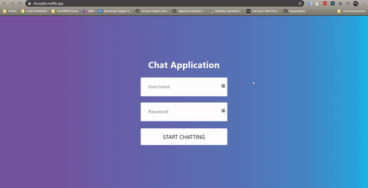

<h1 align="center">React Druzyalar</h1>

<div align="center" id="top">


&#xa0;

</div>

<p align="center">
  <a href="#dart-about">About</a> &#xa0; | &#xa0; 
  <a href="#sparkles-features">Features</a> &#xa0; | &#xa0;
  <a href="#rocket-technologies">Technologies</a> &#xa0; | &#xa0;
  <a href="#checkered_flag-starting">Starting</a> &#xa0; | &#xa0;
  <a href="https://github.com/komiljonovshohjahon" >Author</a>
</p>

<br>

## :dart: About

React based application where users are able to communicate with each other easily. Click the "<a target="_blank" href="https://druzyalar.netlify.app/">Demo</a>" to open the website.

<div align="center">
  

:point_right: <a target="_blank" href="https://druzyalar.netlify.app/">Demo</a> :point_left:

</div>

## :sparkles: Features

:heavy_check_mark: Simple Log-in\
:heavy_check_mark: Send file: picture or video\
:heavy_check_mark: Real-time chatting

## :rocket: Technologies

The following tools were used in this project:

- [React](https://reactjs.org/)
- [Chat-Engine.io](https://chatengine.io/)
- [Node.js](https://nodejs.org/en/)

## :checkered_flag: Starting

```bash

# Clone this project
$ git clone https://github.com/komiljonovshohjahon/telegram-clone

# Access
$ cd telegram-clone

# Install all dependencies
$ npm install

# Run the project
$ npm start

# The server will initialize in the: http://localhost:3000/

```

## :memo: Author

Made with :heart: by <a href="https://github.com/komiljonovshohjahon" target="_blank">Shokhjakhon</a>

<a href="#top">Back to top</a>
